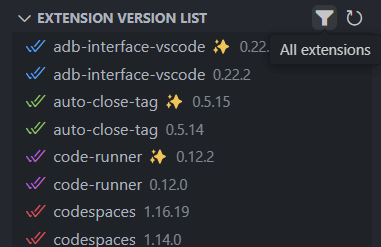

# Vscode Duplicate Extension

## Introduction / 介绍

This extension can identify unused or outdated extensions.

该插件可以找出未使用或过时的扩展。

## Features / 特性

- Quickly identify unused or outdated extensions.
- Conveniently manage extensions directly from the Explorer menu.
- "✨" represents active extensions.

- 快速识别未使用或过时的扩展。
- 通过资源管理器菜单方便地管理扩展。
- “✨”代表正在使用的拓展